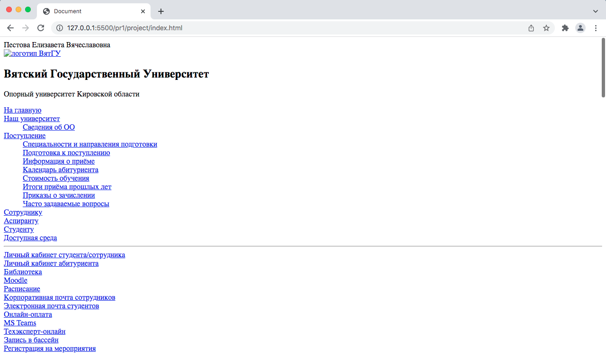

<p align = center>МИНИСТЕРСТВО НАУКИ И ВЫСШЕГО ОБРАЗОВАНИЯ

<p align = center>РОССИЙСКОЙ ФЕДЕРАЦИИ

<p align = center>ФЕДЕРАЛЬНОЕ ГОСУДАРСТВЕННОЕ БЮДЖЕТНОЕ ОБРАЗОВАТЕЛЬНОЕ УЧРЕЖДЕНИЕ ВЫСШЕГО ОБРАЗОВАНИЯ

<p align = center>«ВЯТСКИЙ ГОСУДАРСТВЕННЫЙ УНИВЕРСИТЕТ»

<p align = center>Институт математики и информационных систем

<p align = center>Факультет автоматики и вычислительной техники

<p align = center>Кафедра систем автоматизации управления

<p align = right>Дата сдачи на проверку:

<p align = right>«___» __________ 2022 г.

<p align = right>Проверено:

<p align = right>«___» __________ 2022 г.

<p align = center>Отчет по лабораторной работе № 1

<p align = center>по дисциплине

<p align = center>«Web-программирование»


<p align = center>Разработал студент гр. ИТб-2301-01-00 ________________ /Пестова Е.В./

<p align = center>Проверил ст. преподаватель _________________ /Земцов М.А./

<p align = center>Работа защищена с оценкой «___________» «___» __________ 2022 г.


<p align = center>Киров 2022

__________
Цель: ознакомиться с веб-фреймворком Vue.js

Задачи лабораторной работы:

1. Подключить JavaScript-фреймворк Vue.js
1. Подключить пакет eslint
1. Подключить сборщик модулей Webpack и изучить его настройки
1. Подключить и изучить библиотеку Axios
1. Ознакомиться с языком программирования TypeScript
1. Вывести фамилию, имя и отчество автора
1. Вывести сайт ВятГУ

Ход выполнения:

Создан репозиторий на сайте github.com с названием “web”. В нем создана ветка LR1.

Ссылка на данный репозиторий представлена ниже.

*[ссылка на репозиторий](https://github.com/wxwingim/web/tree/LR1)*

1. Подключить веб-фреймворк VUE

Vue.js представляет современный прогрессивный фреймворк, написанный на языке JavaScript и предназначенный для создания веб-приложений клиентского уровня. Основная сфера применения данного фреймворка - это создание и организация пользовательского интерфейса.

Для подключения необходимо изучить Node.js, который предоставляет большой набор встроенных API, которые помогают создавать различные типы приложений, приложения командной строки, веб-приложения и многое другое. Он также предлагает возможности тестирования и отладки и обширную экосистему пакетов сторонних разработчиков, которые можно легко добавлять в приложение.

Приложение vue создано через пакетный менеджер npm.

2. Подключить пакет eslint

ESLint — инструмент статического анализа кода для выявления проблемных шаблонов, обнаруженных в коде JavaScript.

К текущему проекту был установлен пакет eslint с помощью команды npm install.

После установки он был настроен с помощью команды инициализации npx eslint --init. В качестве стилевого стандарта выбран airbnb.

3. Подключить сборщик модулей Webpack

Webpack — это статический сборщик модулей. Его основная задача — пакетирование файлов JavaScript для использования в браузере, но он также способен преобразовывать, связывать и упаковывать практически любые ресурсы.

К текущему проекту был подключен сборщик модулей Webpack с помощью команды npm install.

Создан файл webpack.config.js, который содержит настройки Webpack. Листинг webpack.config.js представлен в приложении А.

<p align = center>2

__________

4. Подключить и изучить библиотеку Axios

Axios — это библиотека с открытым исходным кодом, позволяющая делать HTTP-запросы. Она предоставляет методы .get(), .post() и .delete().


К текущему проекту была подключена библиотека Axios с помощью пакетного менеджера npm.

5. Ознакомиться с языком программирования TypeScript

TypeScript — это язык программирования, в котором исправлены многие недостатки JavaScript. TypeScript является надмножеством языка JavaScript. TypeScript включает функции кода, несовместимые с браузером.

Для установки компилятора TypeScript была применена команда npm install -g typescript.

6. Вывести фамилию, имя и отчество автора

В ходе работы был создан пакет nadepack, в котором создан файл index.ts.
Листинг данного файла представлен в приложении Б. Отображение фимилии, имени и отчества представлено на рисунке 1.

Создан каталог проекта project, в котором находится файл index.html. Его листинг представлен в приложении В.

7. Вывести сайт ВятГУ

Создан второй пакет под названием lab1pack. Для реализации задания использованы инструменты библиотеки Axios.

Листинг данного компонента представлен в приложении Г.
Фрейм с сайтом ВятГУ представлен на рисунке 1.

<p align=center></p>

<p align = center>Рисунок 1 – Страница, отображающая ФИО и сайт ВятГУ

Вывод: в ходе лабораторной работы были изучены: веб-фреймворк VUE, eslint, сборщик модулей Webpack, библиотека Axios, язык программирования TypeScript. С помощью перечисленных компонентов на практике реализовано отображение на странице фамилии, имени, отчества и сайта ВятГУ.

<p align = center>3

__________

<p align = center>Приложение А

<p align = center>(обязательное)

<p align = center>Листинг webpack.config.js

```javascript
const path = require('path');

module.exports = {
  entry: './src/index.js',
  output: {
    filename: 'main.js',
    path: path.resolve(__dirname, 'dist'),
  },
};

```
<p align = center>4

__________

<p align = center>Приложение Б

<p align = center>(обязательное)

<p align = center>Листинг index.ts

```javaScript
declare let Vue:any;

const appl = Vue.createApp({});

appl.component('name', {
    data() {
        return {
            lastName: 'Пестова',
            firstName: 'Елизавета',
            middleName: 'Вячеславовна',
        };
    },

    template: '<div>{{lastName}} {{firstName}} {{middleName}}</div>',
});
```

<p align = center>5

__________

<p align = center>Приложение B

<p align = center>(обязательное)

<p align = center>Листинг index.html

```html
<!DOCTYPE html>
<html lang="en">
<head>
    <meta charset="UTF-8">
    <meta http-equiv="X-UA-Compatible" content="IE=edge">
    <meta name="viewport" content="width=device-width, initial-scale=1.0">
    <title>Document</title>
</head>
<body>
    <div id="app">
        <name></name>
    </div>
    <div id="vtsu"></div>

    <div id="frm">
        <forma></forma>
    </div>

    <script src="https://unpkg.com/vue@next"></script>

    <script type="module" src="./../lab1pack/src/index.js"></script>

    <script src="./../nodepack/dist/index.js"></script>

    <script>
        appl.mount('#app');
    </script>   


</body>
</html>
```
<p align = center>6

______

<p align = center>Приложение Г

<p align = center>(обязательное)

<p align = center>Листинг index.ts

```javaScript
// eslint-disable-next-line @typescript-eslint/no-var-requires
const axios = require('axios').default;
const vtsu = document.getElementById("vtsu");
const d = document.createElement("div");

let result = null;
axios.get('https://new.vyatsu.ru/').then((response: { data: any; }) => {
    result = response.data;
    d.innerHTML = result;
    vtsu?.appendChild(d);
});

```
<p align = center>7

__________

<p align = center>Приложение Г

<p align = center>(справочное)

<p align = center>Библиографический список

- <https://docs.microsoft.com/ru-ru/learn/paths/vue-first-steps/>
- <https://docs.microsoft.com/ru-ru/learn/paths/build-javascript-applications-nodejs/>
- <https://docs.microsoft.com/ru-ru/learn/paths/build-javascript-applications-typescript/>
- <https://skillbox.ru/media/code/typescript_kak_s_nim_rabotat_i_chem_on_otlichaetsya_ot_javascript/>
- <https://habr.com/ru/company/ruvds/blog/477286/>
- <https://medium.com/nuances-of-programming/введение-в-webpack-для-новичков-6cafbf562386>

<p align = center>8
