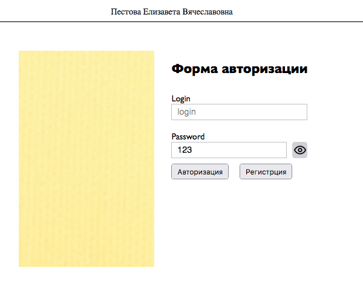
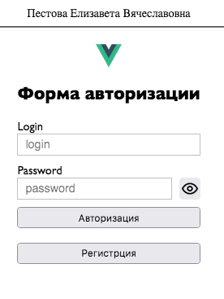

<p align = center>МИНИСТЕРСТВО НАУКИ И ВЫСШЕГО ОБРАЗОВАНИЯ

<p align = center>РОССИЙСКОЙ ФЕДЕРАЦИИ

<p align = center>ФЕДЕРАЛЬНОЕ ГОСУДАРСТВЕННОЕ БЮДЖЕТНОЕ ОБРАЗОВАТЕЛЬНОЕ УЧРЕЖДЕНИЕ ВЫСШЕГО ОБРАЗОВАНИЯ

<p align = center>«ВЯТСКИЙ ГОСУДАРСТВЕННЫЙ УНИВЕРСИТЕТ»

<p align = center>Институт математики и информационных систем

<p align = center>Факультет автоматики и вычислительной техники

<p align = center>Кафедра систем автоматизации управления

<p align = right>Дата сдачи на проверку:

<p align = right>«___» __________ 2022 г.

<p align = right>Проверено:

<p align = right>«___» __________ 2022 г.

<p align = center>Отчет по лабораторной работе № 1

<p align = center>по дисциплине

<p align = center>«Web-программирование»

<p align = center>Вариант 2


<p align = center>Разработал студент гр. ИТб-2301-01-00 ________________ /Пестова Е.В./

<p align = center>Проверил ст. преподаватель _________________ /Земцов М.А./

<p align = center>Работа защищена с оценкой «___________» «___» __________ 2022 г.


<p align = center>Киров 2022

__________
Цель: создать форму авторизации в виде пакета с использованием компонентов Vue. Форма должна быть адаптированна к мобильным приложениям.

Ход выполнения:

Создана ветка LR2.

Ссылка на данный репозиторий представлена ниже.

*[ссылка на репозиторий](https://github.com/wxwingim/web/tree/LR2)*

Создан пакет с помощью VueCLI.

Форма авторизации содержит поле ввода логина и пароля, кнопку для авторизации в правой половине, а в левой половине находится изображение. Для мобильной версии вместо изображения появляется логотип и все элементы располагаются вертикально. Компонент авторизации представлен на рисунке 1, компонент авторизации для мобильной версии представлен на рисунке 2.

Листинг компонента представлен в приложении А.

<p align=center></p>

<p align = center>Рисунок 1 – Форма авторизации пользователя

<p align=center></p>

<p align = center>Рисунок 2 – Мобильная адаптация формы авторизации пользователя

Вывод: в ходе лабораторной работы была создана адаптивная форма авторизации пользователя.

<p align = center>2

__________

<p align = center>Приложение А

<p align = center>(обязательное)

<p align = center>Листинг Forma.vue

```html
<template>
<div class="f-container">
  <div class="f-image"></div>

  

  <form class="f-form">
    <h2>Форма авторизации</h2>

    <div class="f-input">
      <label>Login</label>
      <input type="text" placeholder="login" class="input-login">
    </div>

    <div class="f-input">
      <label>Password</label>
      <div class="password">
        <input type="password" id="passwd" placeholder="password" class="password-input">
        <button class="pass-aye" type="password" v-on:click="switchVisibility"></button>
      </div>
    </div>

    <div class="button">
      <button @click="auth">Авторизация</button>
      <button>Регистрция</button>
    </div>

  </form>
</div>
</template>

<script lang="ts">
import { defineComponent } from 'vue';

export default defineComponent({
  name: 'forma',
  data() {
    return {
      passwordFieldType: false
    };
  },
  methods: {
    switchVisibility() {
      let pass: HTMLInputElement;
      this.passwordFieldType = !this.passwordFieldType;
      pass = document.getElementById("passwd") as HTMLInputElement;

      if (this.passwordFieldType){
        pass.type = "text";
      } else {
        pass.type = "password";
      }
    },
    auth(){
    }
  }
});
</script>

<style scope>
.f-container{
  width: auto;
  margin: 0 auto;
  display: flex;
  flex-direction: column;
  justify-content: center;
  align-items: center;
  font-family:'Gill Sans', sans-serif;
  }
img {
  width: 10%;
  height: 10%;
}
.f-input{
  display: flex;
  flex-direction: column;
  margin: 10px 0px;
  border-radius: 5px;
}

.password-input{
  width: 100%;
}

form{
  width: -webkit-fill-available;
}

.password{
  display: flex;
  align-items: center;
  justify-content: space-between;
}

.pass-aye{
  height: 30px;
  width: 30px;
  background-image: url("https://img.icons8.com/material-outlined/24/000000/visible--v1.png");
  background-position: center;
  background-repeat: no-repeat;
  border: none;
  border-radius: 5px;
}

button{
  padding: 5px 10px;
}

.button {
  display: flex;
  flex-direction: column;
  gap: 20px;
}

input,
textarea {
  font: 1em sans-serif;
  padding: 5px 10px;
  margin: 0 10px 0 0;
  box-sizing: border-box;
  border: none;
  width: 100%;
  border: 1px solid rgb(192, 192, 192);
}

@media (min-width: 768px) {
  .f-container{
    max-width: 800px;
    flex-direction: row;
    align-items: flex-start;
    width: 100%;
  }
  .f-image{
  width: 250px;
  height: 400px;
  margin: 32px 0px;
  background: url('./../assets/pexels-j-lee-6847584.jpg');
  }
  .f-logo{
    display: none;
  }
  form{
    margin: 1em;
    padding: 1em;
    width: auto;
    display: flex;
    flex-direction: column;
  }

  .button {
    display: flex;
    flex-direction: row;
    gap: 20px;
  }
}
</style>
```
<p align = center>3
