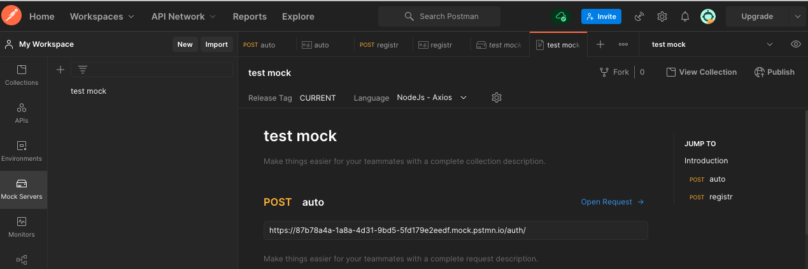

<p align = center>МИНИСТЕРСТВО НАУКИ И ВЫСШЕГО ОБРАЗОВАНИЯ

<p align = center>РОССИЙСКОЙ ФЕДЕРАЦИИ

<p align = center>ФЕДЕРАЛЬНОЕ ГОСУДАРСТВЕННОЕ БЮДЖЕТНОЕ ОБРАЗОВАТЕЛЬНОЕ УЧРЕЖДЕНИЕ ВЫСШЕГО ОБРАЗОВАНИЯ

<p align = center>«ВЯТСКИЙ ГОСУДАРСТВЕННЫЙ УНИВЕРСИТЕТ»

<p align = center>Институт математики и информационных систем

<p align = center>Факультет автоматики и вычислительной техники

<p align = center>Кафедра систем автоматизации управления

<p align = right>Дата сдачи на проверку:

<p align = right>«___» __________ 2022 г.

<p align = right>Проверено:

<p align = right>«___» __________ 2022 г.

<p align = center>Отчет по лабораторной работе № 3

<p align = center>по дисциплине

<p align = center>«Web-программирование»


<p align = center>Разработал студент гр. ИТб-2301-01-00 ________________ /Пестова Е.В./

<p align = center>Проверил ст. преподаватель _________________ /Земцов М.А./

<p align = center>Работа защищена с оценкой «___________» «___» __________ 2022 г.


<p align = center>Киров 2022

__________
Цель: создать mock-сервер для авторизации и регистрации.

Ход выполнения:

Создана ветвь LR3 в репозитории *[ссылка на репозиторий](https://github.com/wxwingim/web/tree/LR3)*.

В ходе выполнения работы с помощью Postman создан Mock Server, представлен на рисунке 1.

<p align=center></p>

<p align = center>Рисунок 1 – Mock Server

Был создан Post запрос для авторизации и Post запрос для регистрации. Запрос авторизации представлен на рисунке 2. Запрос регистрации представлен на рисунке 3.

<p align=center></p>

<p align = center>Рисунок 2 – Запрос авторизации

<p align=center></p>

<p align = center>Рисунок 3 – Запрос регистрации

Листинг компонента Autorization.vue представлен в приложении А. Результат работы запроса на авторизацию представлен на рисунках 4 и 5.

<p align=center></p>

<p align = center>Рисунок 4 – Удачный вход

<p align=center></p>

<p align = center>Рисунок 5 – Неудачный вход

Листинг компонента Registration.vue представлен в приложении Б. Результат работы запроса на регистрацию представлен на рисунках 6 и 7.

<p align=center></p>

<p align = center>Рисунок 6 – Удачная регистрация

<p align=center></p>

<p align = center>Рисунок 7 – Неудачная регистрация

Вывод: в ходе лабораторной работы был создан mock-сервер и реализованы запросы на авторизацию и регистрацию, проведено тестирование отправки созданных запросов на сервер.

<p align = center>2

__________

<p align = center>Приложение А

<p align = center>(обязательное)

<p align = center>Листинг компонента Autorization.vue

```html
<template>
<div class="f-container">
  <div class="f-image"></div>

  

  <form class="f-form">
    <h2>Авторизация</h2>

    <div class="f-input">
      <label>Login</label>
      <input v-model="log" type="text" placeholder="login" class="input-login">
    </div>

    <div class="f-input">
      <label>Password</label>
      <div class="password">
        <input v-model="pus" type="password" id="passwd" placeholder="password" class="password-input">
        <button class="pass-aye" v-on:click="switchVisibility"></button>
      </div>
    </div>

    <div class="button">
      <button v-on:click="GoAutorization" type="button">Войти</button>
      <router-link to="/registration">Перейти к регистрации</router-link>
    </div>

  </form>
</div>
</template>

<script lang="ts">
import { defineComponent } from 'vue';
import axios from 'axios';

export default defineComponent({
  name: 'autorization',
  data() {
    return {
      passwordFieldType: false,
      log: null,
      pus: null
    };
  },
  methods: {
    switchVisibility() {
      let pass: HTMLInputElement;
      this.passwordFieldType = !this.passwordFieldType;
      pass = document.getElementById("passwd") as HTMLInputElement;

      if (this.passwordFieldType){
        pass.type = "text";
      } else {
        pass.type = "password";
      }
    },

    GoAutorization(){
      const url =  "https://87b78a4a-1a8a-4d31-9bd5-5fd179e2eedf.mock.pstmn.io/auth/";

      const data = {
        login: this.log,
        password: this.pus
      };

      axios.post(url, data, {headers:{'x-mock-match-request-body': true}}).then((res) => {
        console.log(res);
        alert("Авторизация прошла успешно");
      })
      .catch((error) => {
        console.log(error);
        alert("Неверный логин или пароль");
      });
    }
  }
});
</script>

<style scope>

.f-container{
  width: auto;
  margin: 0 auto;
  display: flex;
  flex-direction: column;
  justify-content: center;
  align-items: center;
  }

button{
    background-color: #04AA6D;
    color: white;
    padding: 16px 20px;
    margin: 8px 0;
    border: none;
    cursor: pointer;
    width: 100%;
    opacity: 0.9;
}

img {
  width: 10%;
  height: 10%;
}

.f-input{
  display: flex;
  flex-direction: column;
  margin: 10px 0px;
  border-radius: 5px;
}

.password-input{
  width: 100%;
}

form{
  width: -webkit-fill-available;
}

.password{
  display: flex;
  align-items: center;
  justify-content: space-between;
  background-color: #f1f1f1;
}

.pass-aye{
  height: 30px;
  width: 30px;
  background-image: url("https://img.icons8.com/material-outlined/24/000000/visible--v1.png");
  background-position: center;
  background-repeat: no-repeat;
  background-color: #f1f1f1;
  border: none;
  border-radius: 5px;
}

.button {
  display: flex;
  flex-direction: column;
  gap: 20px;
}

input,
textarea {
  font: 1em sans-serif;
  padding: 5px 10px;
  margin: 0 10px 0 0;
  box-sizing: border-box;
  border: none;
  width: 100%;
  border: none;
}

@media (min-width: 768px) {
  .f-container{
    max-width: 900px;
    flex-direction: row;
    align-items: flex-start;
    width: 100%;
  }
  .f-image{
  width: 250px;
  height: 400px;
  margin: 32px 0px;
  background: url('./../assets/pexels-j-lee-6847584.jpg');
  }
  .f-logo{
    display: none;
  }
  form{
    margin: 1em;
    padding: 1em;
    width: auto;
    display: flex;
    flex-direction: column;
  }
}
</style>

```

<p align = center>3

__________

<p align = center>Приложение Б

<p align = center>(обязательное)

<p align = center>Листинг компонента Registration.vue

```html
<template>
<div class="container">
    <h2>Регистрация</h2>
    <hr>

    <form class="registration-form form-in">
        <div class="input-email">
            <label for="email"><b>Email</b></label>
            <input type="text" v-model="mail" placeholder="Enter Email" name="email" id="email" required>
        </div>
        <p v-if=vError>Введите email!</p>

        <button v-if="!visible" v-on:click="FormEnd" type="submit" class="nextbtn">Далее</button>

        <div v-if="visible">
            <div class="form-in nextinput">
                <label for="psw"><b>Password</b></label>
                <input type="password" v-model="pass" placeholder="Пароль" name="psw" id="psw" required>
            </div>

            <div class="form-in nextinput">
                <label for="log"><b>Login</b></label>
                <input type="text" v-model="log" placeholder="Логин" name="log" id="log" required>
            </div>

            <button v-on:click="RegistrationUser" type="button" class="registerbtn">Регистрация</button>
        </div>
    </form>
</div>

</template>

<script lang="ts">
import { defineComponent } from 'vue';
import axios from 'axios';

export default defineComponent({
    data(){
        return{
            visible: false,
            mail: null,
            pass: null,
            log: null,
            vError: false
        }
    },

    methods: {
        FormEnd() {
            if(this.mail){
                this.visible = !this.visible;
                this.vError = false;
            }
            else{
                this.vError = true;
            }
        },
        RegistrationUser(){
            const url =  "https://87b78a4a-1a8a-4d31-9bd5-5fd179e2eedf.mock.pstmn.io/registr/";

            const data = {
                login: this.log,
                password: this.pass,
                email: this.mail
            };

            axios.post(url, data, {headers:{'x-mock-match-request-body': true}}).then((res) => {
                console.log(res);
                alert("Регистрация прошла успешно");
            })
            .catch((error) => {
                console.log(error);
                alert("Логин занят");
            });
        }
    },

});


</script>

<style scope>
@import './../css/style-registration.css';
</style>
```

<p align = center>4
