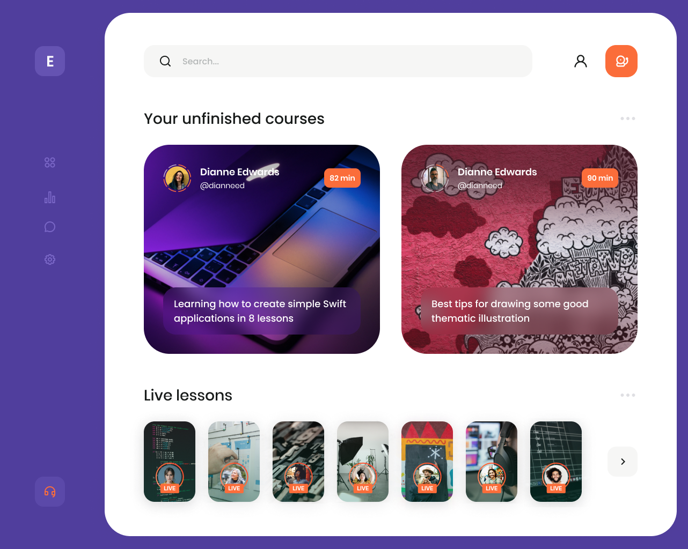
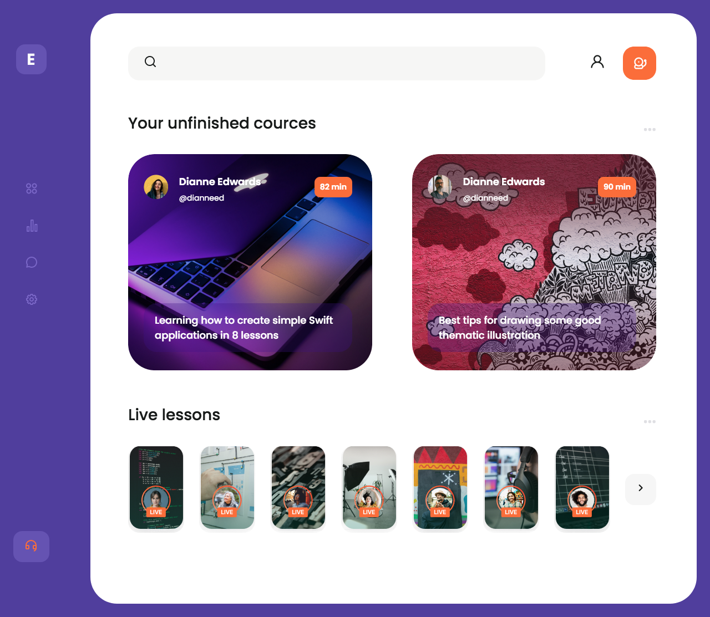
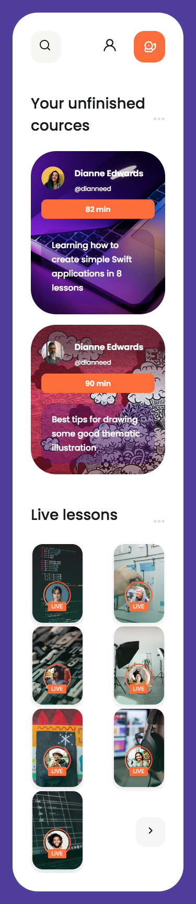

<p align = center>МИНИСТЕРСТВО НАУКИ И ВЫСШЕГО ОБРАЗОВАНИЯ

<p align = center>РОССИЙСКОЙ ФЕДЕРАЦИИ

<p align = center>ФЕДЕРАЛЬНОЕ ГОСУДАРСТВЕННОЕ БЮДЖЕТНОЕ ОБРАЗОВАТЕЛЬНОЕ УЧРЕЖДЕНИЕ ВЫСШЕГО ОБРАЗОВАНИЯ

<p align = center>«ВЯТСКИЙ ГОСУДАРСТВЕННЫЙ УНИВЕРСИТЕТ»

<p align = center>Институт математики и информационных систем

<p align = center>Факультет автоматики и вычислительной техники

<p align = center>Кафедра систем автоматизации управления

<p align = right>Дата сдачи на проверку:

<p align = right>«___» __________ 2022 г.

<p align = right>Проверено:

<p align = right>«___» __________ 2022 г.

<p align = center>Отчет по лабораторной работе № 1

<p align = center>по дисциплине

<p align = center>«Web-программирование»


<p align = center>Разработал студент гр. ИТб-2301-01-00 ________________ /Пестова Е.В./

<p align = center>Проверил ст. преподаватель _________________ /Земцов М.А./

<p align = center>Работа защищена с оценкой «___________» «___» __________ 2022 г.


<p align = center>Киров 2022

__________
Цель: выполнить верстку dashboard-страницы, разбив ее на компоненты, реализовать адаптивную верстку.

Ход выполнения:

Создана ветвь LR4 в репозитории *[ссылка на репозиторий](https://github.com/wxwingim/web/tree/LR4)*.

Для реализации выбран макет, он представлен на рисунке 1.

<p align=center></p>

<p align = center>Рисунок 1 – Макет dashboard-страницы

Были реализованы 3 компонента: Header.vue, Menu.vue, Main.vue. Листинги этих компонентов представлены в приложениях А, Б и В. Реализованный макет представлен на рисунке 2.

<p align=center></p>

<p align = center>Рисунок 2 – Реализованный макет

Реализованный макет для мобильных устройств представлен на рисунке 3.

<p align=center></p>

<p align = center>Рисунок 3 – Реализованный макет для обильного устройства

Вывод: в ходе лабораторной работы была реализована верстка выбранного макета dashboard-страницы с помощью компонентов Vue.js.

<p align = center>2

__________

<p align = center>Приложение А

<p align = center>(обязательное)

<p align = center>Листинг компонента Header.vue

```html
<template>
  <header>
    <div class="search">
      <a href=""></a>
      <input type="text" placeholder="Search.." name="search">
    </div>

    <div class="header-icons">
      <a href=""></a>
      <a href="" class="header-orange">
        
      </a>
    </div>
  </header>
</template>

<script lang="ts">
import { defineComponent } from 'vue';

export default defineComponent ({
});
</script>

<!-- Add "scoped" attribute to limit CSS to this component only -->
<style>
@import url("./../css/header.css");
</style>
```

<p align = center>3

__________

<p align = center>Приложение Б

<p align = center>(обязательное)

<p align = center>Листинг компонента Menu.vue

```html
<template>
<div class="left-menu">
  <div class="logo">
      <a href="" class="menu-logo"><span class="menu-top">E</span></a>
  </div>

  <div class="menu-buttons">
    <button class="menu-button1" type="button">
      
    </button>

    <button class="menu-button2" type="button">
      
    </button>

    <button class="menu-button3" type="button">
      
    </button>

    <button class="menu-button1" type="button">
      
    </button>

  </div>

  <div class="menu-bottom">
      
  </div>
</div>

</template>

<script>
export default {

}
</script>

<style>
@import "./../css/menu.css";
</style>
```

<p align = center>4

__________

<p align = center>Приложение В

<p align = center>(обязательное)

<p align = center>Листинг компонента Main.vue

```html
<template>
  <main class="main-container">
      <div class="main-block main-unfinished-cources">
          <!-- header -->
          <div class="main-head">
              <h4>Your unfinished cources</h4>
              <button>...</button>
          </div>

          <!-- cards -->
          <div class="main-cources-card">

            <!-- card1 -->
            <div class="card card1">
                <div class="cources-card-top">
                    <div class="cources-autor">
                        <div class="person person1"></div>
                        <div class="about-person">
                            <p>Dianne Edwards</p>
                            <a href="">@dianneed</a>
                        </div>
                    </div>
                    <button>82 min</button>
                </div>
                <div class="cources-card-bottom">
                    <p>Learning how to create simple Swift applications in 8 lessons</p>
                </div>
            </div>

            <!-- card2 -->
            <div class="card card2">
                <div class="cources-card-top">
                    <div class="cources-autor">
                        <div class="person person2"></div>
                        <div class="about-person">
                            <p>Dianne Edwards</p>
                            <a href="">@dianneed</a>
                        </div>
                    </div>
                    <button>90 min</button>
                </div>
                <div class="cources-card-bottom">
                    <p>Best tips for drawing some good thematic illustration</p>
                </div>
            </div>

          </div>
      </div>

      <div class="main-block main-live-lessons">
          <!-- header -->
          <div class="main-head">
              <h4>Live lessons</h4>
              <button>...</button>
          </div>

          <!-- cards -->
          <div class="main-lessons">

              <!-- card1 -->
              <div class="card-lesson card-1">
                    
              </div>

                <!-- card2 -->
              <div class="card-lesson card-2">
                    
              </div>

                <!-- card3 -->
              <div class="card-lesson card-3">
                    
              </div>

                <!-- card4 -->
              <div class="card-lesson card-4">
                    
              </div>

                <!-- card5 -->
              <div class="card-lesson card-5">
                    
              </div>

                <!-- card6 -->
              <div class="card-lesson card-6">
                    
              </div>

                <!-- card7 -->
              <div class="card-lesson card-7">
                    
              </div>

              <button class="next-button"></button>

          </div>
      </div>
  </main>
</template>

<script>
export default {

}
</script>

<style scope>
@import './../css/main.css';
</style>
```

<p align = center>5
