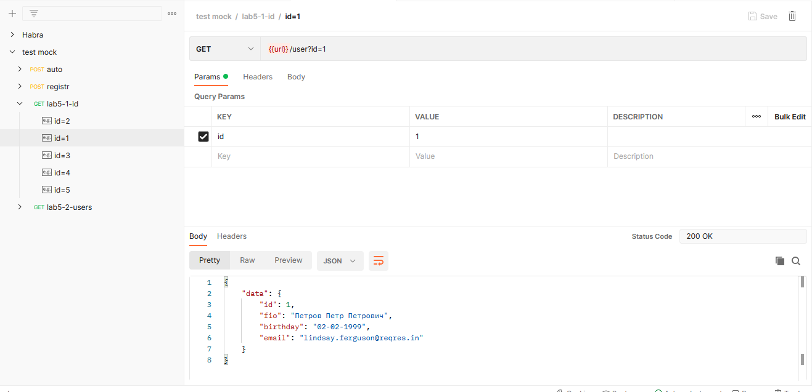
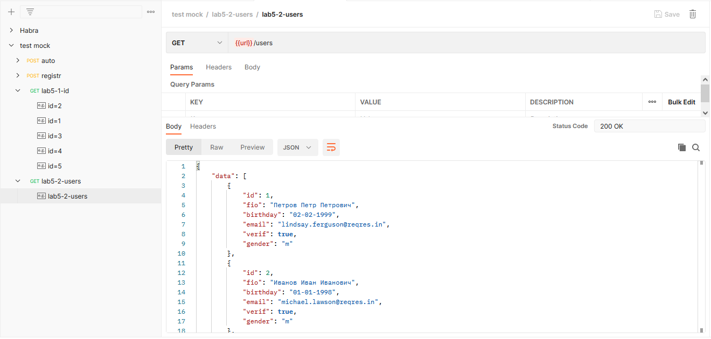
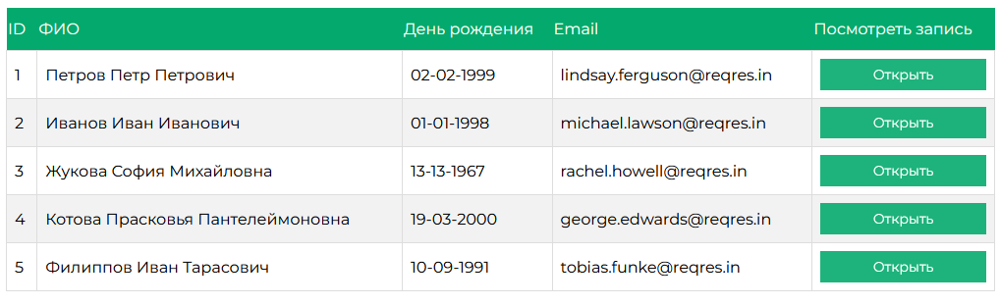
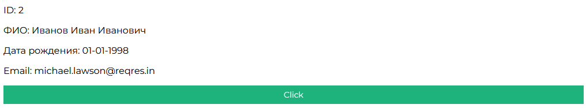

<p align = center>МИНИСТЕРСТВО НАУКИ И ВЫСШЕГО ОБРАЗОВАНИЯ

<p align = center>РОССИЙСКОЙ ФЕДЕРАЦИИ

<p align = center>ФЕДЕРАЛЬНОЕ ГОСУДАРСТВЕННОЕ БЮДЖЕТНОЕ ОБРАЗОВАТЕЛЬНОЕ УЧРЕЖДЕНИЕ ВЫСШЕГО ОБРАЗОВАНИЯ

<p align = center>«ВЯТСКИЙ ГОСУДАРСТВЕННЫЙ УНИВЕРСИТЕТ»

<p align = center>Институт математики и информационных систем

<p align = center>Факультет автоматики и вычислительной техники

<p align = center>Кафедра систем автоматизации управления

<p align = right>Дата сдачи на проверку:

<p align = right>«___» __________ 2022 г.

<p align = right>Проверено:

<p align = right>«___» __________ 2022 г.

<p align = center>Отчет по лабораторной работе № 5

<p align = center>по дисциплине

<p align = center>«Web-программирование»


<p align = center>Разработал студент гр. ИТб-2301-01-00 ________________ /Пестова Е.В./

<p align = center>Проверил ст. преподаватель _________________ /Земцов М.А./

<p align = center>Работа защищена с оценкой «___________» «___» __________ 2022 г.


<p align = center>Киров 2022

__________
Цель: выполнить GET запроса на получение одного объекта по id и GET запрос на получение некоторого количества объектов. Результат вывести в таблицу.

Ход выполнения:

Создана ветвь LR5 в репозитории *[ссылка на репозиторий](https://github.com/wxwingim/web/tree/LR5)*.

Создано два запроса в Postman. Запросы представлены на рисунках 1 и 2.

<p align=center></p>

<p align = center>Рисунок 1 – Запрос на получение одного объекта

<p align=center></p>

<p align = center>Рисунок 2 – Запрос на получение нескольких объектов

Для визуализации результатов запроса создана таблица. При открытии подробной информации по кнопке выполняется запрос на получение объекта по id. Результаты представлены на ривунках 3 и 4.

<p align=center></p>

<p align = center>Рисунок 3 – Результат запроса на получение нескольких объектов

<p align=center></p>

<p align = center>Рисунок 4 – Результат запроса на получение одного объекта

Вывод: в ходе выполнения лабораторной работы были получены данные с mock-сервера и организовано взаимодействие пользователя с ними. Данные отображены в таблицу, при нажатии на кнопку "Открыть" в таблице выполняется переход на страницу с информацией об выбранном объекте.

<p align = center>2

__________

<p align = center>Приложение А

<p align = center>(обязательное)

<p align = center>Листинг компонента Lab5.vue

```html
<template>
    <div>
        <section>
            <Lab5Table
                :users_data="USERS"
            />
        </section>
    </div>
</template>

<script lang="ts">
import axios from 'axios';
import { defineComponent } from 'vue';
import Lab5Table from './Lab5Table.vue';
import {mapActions, mapGetters} from 'vuex';
export default defineComponent({
    components:{
        Lab5Table
    },
    data: () => {
        return{
        }
    },
    computed:{
        ...mapGetters([
            'USERS'
        ])
    },
    methods:{
        ...mapActions([
            'GET_ALL_USERS'
        ])
    },
    mounted(){
        this.GET_ALL_USERS();
    }
});
</script>

<style scope>
</style>
```

<p align = center>3

__________

<p align = center>Приложение Б

<p align = center>(обязательное)

<p align = center>Листинг компонента Lab5Table.vue

```html
<template>
<div>
      <table class="users">
    <thead>
        <tr>
            <th>ID</th>
            <th>ФИО</th>
            <th>День рождения</th>
            <th>Email</th>
            <th>Посмотреть запись</th>
        </tr>
    </thead>
  
    <tbody>
        <tr v-for="user in users_data.data" :key="user.id">
            <td>{{ user.id}}</td>
            <td>{{ user.fio }}</td>
            <td>{{ user.birthday }}</td>
            <td>{{ user.email }}</td>
            <td>
                <button v-on:click="$router.push('/detail-user/' + user.id)">Открыть</button>
            </td>
        </tr>
    </tbody>

  </table>    
</div>
</template>

<script lang="ts">
import { defineComponent } from 'vue';
export default {
    props: {
        users_data:{
            type:Array,
            default:()=>{
                return []
            }
        }
    },
};
</script>

<style scope>
@import "./../css/lab5.css";
</style>
```

<p align = center>4

__________

<p align = center>Приложение В

<p align = center>(обязательное)

<p align = center>Листинг компонента DetailUser.vue

```html
<template>
  <div>
      <p>ID: {{ user.id }}</p>
      <p>ФИО: {{ user.fio }}</p>
      <p>Дата рождения: {{ user.birthday }}</p>
      <p>Email: {{ user.email }}</p>
      <button v-on:click="testData">Click</button>
  </div>
</template>

<script lang="ts">
import { computed, defineComponent } from 'vue';
import {mapActions, mapGetters} from 'vuex';
import axios from 'axios';
export default defineComponent({
    data: () => ({
        user: {},
    }),
    computed:{
    },
    methods:{
        testData(){
            console.log(this.user);
        }
    },
    mounted(){
        const id = this.$route.params.id;
        axios.get('https://87b78a4a-1a8a-4d31-9bd5-5fd179e2eedf.mock.pstmn.io/user/' + id)
        .then((res) => {
            console.log(res.data);
            const user = res.data;
            this.user = user.data;
        });
    }
});
</script>

<style>
</style>
```

<p align = center>4

__________

<p align = center>Приложение Г

<p align = center>(обязательное)

<p align = center>Листинг store.ts

```typescript
import Vue from 'vue'
import Vuex from 'vuex'
import axios from 'axios'

const store = new Vuex.Store({
    state: {
        users: [],
        user: null
    },
    actions: {
        GET_ALL_USERS({commit}){
            return axios.get('https://87b78a4a-1a8a-4d31-9bd5-5fd179e2eedf.mock.pstmn.io/users')
            .then((res) => {
                commit('SET_USERS_TO_VUEX', res.data)
            })
        },

        GET_ONE_USER({commit}, id){
            return axios.get('https://87b78a4a-1a8a-4d31-9bd5-5fd179e2eedf.mock.pstmn.io/users/' + id)
            .then((res) => {
                commit('SET_USER_BY_ID', res.data)
            })
        }
    },
    mutations: {
        SET_USERS_TO_VUEX: (state, users) => {
            state.users = users
        },
        SET_USER_BY_ID: (state, user) => {
            state.user = user
        }
    },
    getters: {
        USERS(state){
            return state.users
        },
        USER(state){
            return state.user
        }
    }
})

export default store;
```

<p align = center>5
