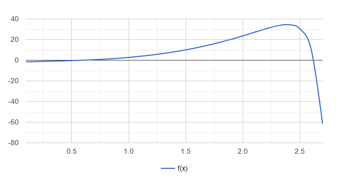

<p align = center>МИНИСТЕРСТВО НАУКИ И ВЫСШЕГО ОБРАЗОВАНИЯ

<p align = center>РОССИЙСКОЙ ФЕДЕРАЦИИ

<p align = center>ФЕДЕРАЛЬНОЕ ГОСУДАРСТВЕННОЕ БЮДЖЕТНОЕ ОБРАЗОВАТЕЛЬНОЕ УЧРЕЖДЕНИЕ ВЫСШЕГО ОБРАЗОВАНИЯ

<p align = center>«ВЯТСКИЙ ГОСУДАРСТВЕННЫЙ УНИВЕРСИТЕТ»

<p align = center>Институт математики и информационных систем

<p align = center>Факультет автоматики и вычислительной техники

<p align = center>Кафедра систем автоматизации управления

<p align = right>Дата сдачи на проверку:

<p align = right>«___» __________ 2022 г.

<p align = right>Проверено:

<p align = right>«___» __________ 2022 г.

<p align = center>Отчет по лабораторной работе № 8

<p align = center>по дисциплине

<p align = center>«Web-программирование»


<p align = center>Разработал студент гр. ИТб-2301-01-00 ________________ /Пестова Е.В./

<p align = center>Проверил ст. преподаватель _________________ /Земцов М.А./

<p align = center>Работа защищена с оценкой «___________» «___» __________ 2022 г.


<p align = center>Киров 2022

__________
Цель: реализовать React-компонент вывода графика математической функции. 

Ход выполнения:

Создана ветвь LR8 в репозитории *[ссылка на репозиторий](https://github.com/wxwingim/web/tree/LR8)*.

В ходе лабораторной работы было создано новое React-приложение. Был установлен пакет react-google-charts для визуализации данных. В компоненте App.tsx реализовано отображении графика y = 3 * x^3 - 2^(e^(x^3 - 2 * x^2 - 1). Листинг компонента представлен в приложении А. Результат работы представлен на рисунке 1.

<p align=center></p>

<p align = center>Рисунок 1 – Отображение графика функции


Вывод: в ходе выполнения лабораторной работы были получены навыки работы с библиотекой для вывода графиков и реализован компонент для вывода графика математической функции.

<p align = center>2

__________

<p align = center>Приложение А

<p align = center>(обязательное)

<p align = center>Листинг App.tsx

```typescript
import React from 'react';
import { Chart } from 'react-google-charts';
import './App.css';

export const data = returnData(27);

function returnData(len: number){
  const data: any = [
    ["x", "f(x)"],
  ];
  for (let i = 1; i <= len; i++){
    let coup: [number, number];
    let x = i/10;
    let y = 3*Math.pow(x, 3) - 2*Math.pow(Math.E, (Math.pow(x,3)-2*x*x-1)) + Math.log(x)/Math.log(13);
    coup = [x, y];
    data[i] = coup;
  }

  return data;
}

export const options = {
  curveType: "function",
  legend: {position: "bottom"},
}

function App() {
  return (
    <div className="App">
      <Chart 
        chartType="LineChart"
        width= "100%"
        height="400px"
        data={data}
        options={options}
      />
    </div>
  );
}

export default App;
```
<p align = center>3